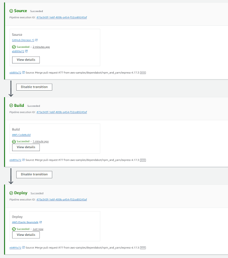

# Continuous Delivery Pipeline for a Web Application

This project demonstrates how to set up a continuous delivery pipeline for a simple web application. The pipeline automatically deploys your application to AWS Elastic Beanstalk whenever the source code is updated in GitHub.

## Key Concepts

- **GitHub**: Source code version control.
- **AWS Elastic Beanstalk**: Web application hosting.
- **AWS CodeBuild**: Builds the application from GitHub.
- **AWS CodePipeline**: Automates the build and deployment process.

## Steps Covered

1. **Set Up GitHub Repo**: Store your application code in GitHub.
2. **Deploy Web App**: Set up AWS Elastic Beanstalk for hosting.
3. **Create Build Project**: Configure AWS CodeBuild to build the app.
4. **Create Delivery Pipeline**: Automate build and deploy with AWS CodePipeline.
5. **Finalize Pipeline**: Add a review stage and test the pipeline.

   
Setting up Elastic beanstalk for deployment

Setting up codepipeline for deployment

Pipeline Successfully Executed

